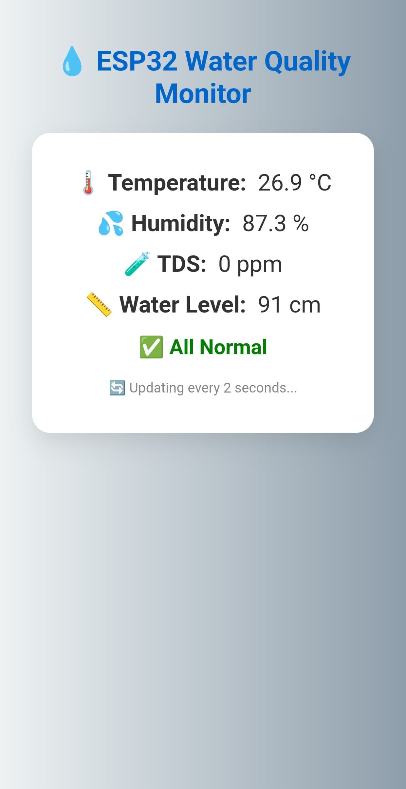
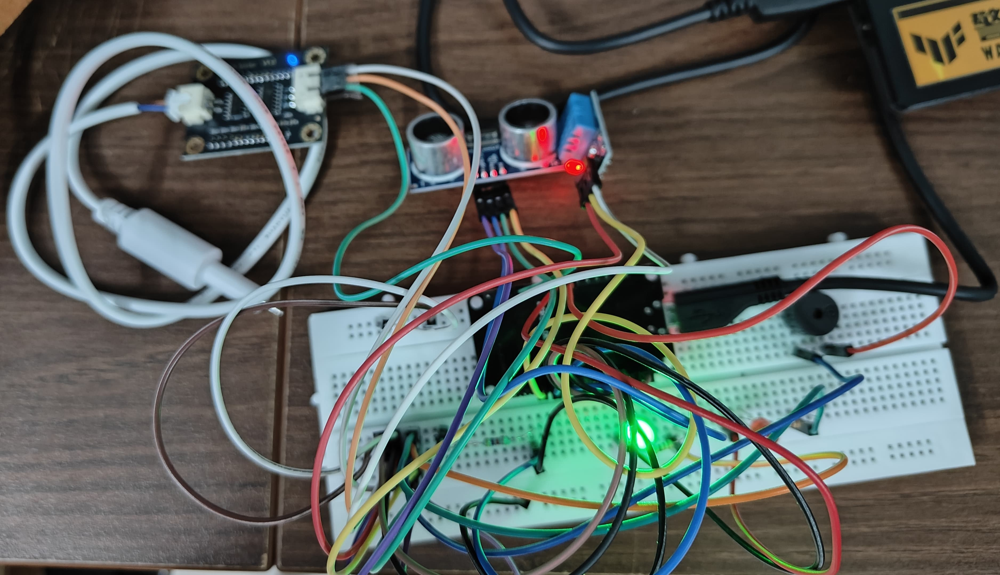

# ESP32 Water Quality Monitoring System

This project monitors water quality and water level in real time using an ESP32 and multiple sensors.

## Dashboard

## Hardware Setup

## Features
- Water purity monitoring using TDS sensor
- Temperature monitoring using DHT11
- Water level detection using ultrasonic sensor
- LED and buzzer alerts
- Real-time mobile web dashboard
